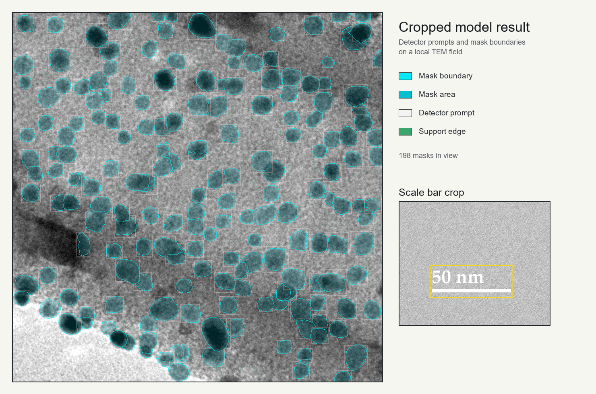

# Catalyst TEM Particle Analysis Demo

[](https://github.com/iserlohn0522-cell/catalyst-tem-particle-analysis-demo/actions/workflows/ci.yml)

A public portfolio repo for TEM catalyst particle analysis.

The runnable demo uses synthetic images. The repo keeps the engineering pieces that matter for a microscopy workflow: manifests with scale metadata and hashes, detector-prompted segmentation, scale-aware measurements, review overlays, tests, and a safety scan.

## Portfolio Snapshot

| Item | Summary |
|---|---|
| Domain | Catalyst TEM image analysis / scientific microscopy |
| Public scope | Synthetic runnable data; one cropped model-result preview PNG |
| Demonstrated skills | Python packaging, image analysis, segmentation workflow design, provenance, metric reporting, testing, release hygiene |
| Outputs | Review overlays, JSON report, summary Markdown, morphology metrics |
| Private research boundary | No source TEM/STEM images, private annotations, trained weights, checkpoints, inference JSON, or unpublished results included |

## What The Repo Includes

- Synthetic TEM-like image generation with known particle labels.
- A manifest contract with per-image scale, allowed-use metadata, and SHA-256 hashes.
- A transparent detector-prompted segmentation workflow.
- Per-image count, precision, recall, F1, equivalent diameter, circularity, and nearest-neighbor summaries.
- Human-review-friendly overlays with ground truth boxes, predicted boxes, and segmentation masks.
- A repository safety scan that blocks raw microscopy formats, model weights, checkpoints, private paths, and oversized files.

The public detector is simple and deterministic. It stands in for a private research model and does not support a state-of-the-art claim.

## Public Demo vs. Private Research Version

The public code path uses deterministic synthetic stand-ins. It follows the same workflow shape as the private project:

```text
detection -> segmentation -> measurement -> QC overlay -> report
```

Do not read this repo as a YOLO, SAM, or benchmark-performance claim. This release leaves those model implementations and private results out. A private or post-publication release can replace `detector.py` and `segmentation.py` with YOLO/SAM-style components while keeping the manifest, measurement, reporting, and safety-scan contracts.

## Safety Policy

This repo excludes:

- Raw research TEM/STEM images.
- Trained weights, checkpoints, or model binaries.
- Private manifests, internal experiment outputs, cluster scripts, or unpublished research reports.
- Code, data, images, README text, or weights copied from related projects.

The runnable examples use synthetic images. The model-result preview is a cropped PNG. Source images, model-output files, annotation files, checkpoints, and private paths stay outside the public repo.

## Example Outputs

The runnable example uses synthetic images under `examples/synthetic_dataset` and writes results to `docs/assets/demo_run`.



This preview comes from a private model-output rendering. The repo includes only the cropped PNG from that run. Source images, model-output files, annotation files, checkpoints, and private paths stay outside. Use it as a visual workflow preview, not a benchmark.

The runtime writes:

- `demo_outputs/report.json`
- `demo_outputs/summary.md`
- `demo_outputs/overlays/*.png`

The committed synthetic summary lives at [docs/assets/demo_run/summary.md](docs/assets/demo_run/summary.md).

Metric meanings:

- `count`: number of ground-truth or predicted synthetic particles.
- `precision`: fraction of predicted particles that match a synthetic ground-truth particle.
- `recall`: fraction of synthetic ground-truth particles recovered by the demo detector.
- `F1`: harmonic mean of precision and recall.
- `equivalent diameter`: diameter of a circle with the same measured mask area, converted by the per-image scale.
- `circularity`: compactness of a measured mask, with higher values indicating more circle-like masks.
- `nearest-neighbor distance`: distance from each detected particle center to its nearest detected neighbor, converted by the per-image scale.

## Developer Commands

```bash
# install
python -m pip install -e ".[dev]"

# generate synthetic demo data
python -m tem_particle_demo.cli generate --output examples/synthetic_dataset --count 4 --seed 7

# run the pipeline
python -m tem_particle_demo.cli run --manifest examples/synthetic_dataset/manifest.csv --output demo_outputs

# run tests
python -m pytest -q

# run release-safety checks
python scripts/safety_scan.py .
```

The run command writes:

- `demo_outputs/report.json`
- `demo_outputs/summary.md`
- `demo_outputs/overlays/*.png`

For the committed example assets, see `docs/assets/demo_run`.

## Repository Structure

```text
src/tem_particle_demo/
  synthetic.py      # synthetic public-demo image and label generation
  manifest.py       # manifest IO, relative path validation, SHA-256 checks
  detector.py       # transparent dark-particle proposal detector
  segmentation.py   # box-prompted local segmentation stand-in
  metrics.py        # count, matching, morphology, and spacing metrics
  overlays.py       # review overlay rendering
  pipeline.py       # end-to-end analysis workflow
  cli.py            # command-line entrypoints

tests/              # unit and end-to-end tests
scripts/            # repository safety scan
docs/               # references and publication roadmap
examples/           # generated synthetic demo dataset
```

## Related Work

This project sits near prior work on automated nanoparticle analysis, supported-catalyst TEM/STEM measurement, detector-guided segmentation, and foundation models for microscopy. The closest neighbors use detector-to-SAM workflows, pretrained SAM workflows for nanoparticle TEM, and catalyst-focused deep-learning pipelines.

This public demo keeps the engineering layer: manifest provenance, scale/QC reporting, review overlays, tests, and release checks.

Selected related work:

- Genc et al., "A versatile machine learning workflow for high-throughput analysis of supported metal catalyst particles", Ultramicroscopy, 2025. [DOI](https://doi.org/10.1016/j.ultramic.2025.114116), [GitHub](https://github.com/ArdaGen/STEM-Automated-Nanoparticle-Analysis-YOLOv8-SAM)
- Zhong et al., "Automated Particle Size Analysis of Supported Nanoparticle TEM Images Using a Pre-Trained SAM Model", Nanomaterials, 2025. [DOI](https://doi.org/10.3390/nano15241886)
- Monteiro et al., "Pre-trained artificial intelligence-aided analysis of nanoparticles using the segment anything model", Scientific Reports, 2025. [DOI](https://doi.org/10.1038/s41598-025-86327-x)
- Treder et al., "nNPipe: a neural network pipeline for automated analysis of morphologically diverse catalyst systems", npj Computational Materials, 2023. [DOI](https://doi.org/10.1038/s41524-022-00949-7)
- Aviles and Lear, "Practical Guide to Automated TEM Image Analysis for Increased Accuracy and Precision in the Measurement of Particle Size and Morphology", ACS Nanoscience Au, 2025. [DOI](https://doi.org/10.1021/acsnanoscienceau.4c00076)
- Meyer et al., "Recommendations to standardize reporting, execution and interpretation of STEM/TEM measurements", Journal of Catalysis, 2024. [DOI](https://doi.org/10.1016/j.jcat.2024.115480)
- Kirillov et al., "Segment Anything", ICCV, 2023. [DOI](https://doi.org/10.1109/ICCV51070.2023.00371)
- Archit et al., "Segment Anything for Microscopy", Nature Methods, 2025. [DOI](https://doi.org/10.1038/s41592-024-02580-4)
- Meng et al., "Automatic extraction of scale information for interactive measurement of anything in microscopy images", Knowledge-Based Systems, 2025. [DOI](https://doi.org/10.1016/j.knosys.2025.113578)
- Schneider et al., "NIH Image to ImageJ: 25 years of image analysis", Nature Methods, 2012. [DOI](https://doi.org/10.1038/nmeth.2089)

See [docs/references.md](docs/references.md) for a longer annotated list.

## Future Publication Role

After publication, this repo can become a paper companion repository. That release would add:

- The final paper citation and tagged release.
- Reproducible configuration files for the published method.
- Public or access-controlled data instructions.
- Model-weight download instructions only if redistribution is permitted.
- Full benchmark tables and analysis notebooks after embargo or publication constraints are cleared.

See [docs/publication-roadmap.md](docs/publication-roadmap.md).

## License

Code in this repository is released under the MIT License. Synthetic demo images generated by this repository are released for public demo use with the code.
