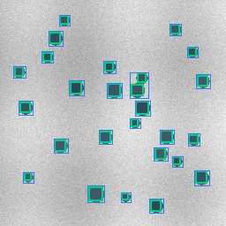

# Catalyst TEM Particle Analysis Demo

A data-safe public demo of an auditable TEM particle-analysis workflow for catalyst images.

This repository is designed for portfolio review and future publication support. It shows how a microscopy analysis project can be structured around synthetic data, manifest-based provenance, detector-prompted segmentation, scale-aware measurements, review overlays, tests, and a safety scan.



## What This Demo Shows

- Synthetic TEM-like image generation with known particle labels.
- A manifest contract with per-image scale, allowed-use metadata, and SHA-256 hashes.
- A transparent detector-prompted segmentation workflow.
- Per-image count, precision, recall, F1, equivalent diameter, circularity, and nearest-neighbor summaries.
- Human-review-friendly overlays with ground truth boxes, predicted boxes, and segmentation masks.
- A repository safety scan that blocks raw microscopy formats, model weights, checkpoints, private paths, and oversized files.

The detector in this public demo is intentionally simple and deterministic. It is a safe stand-in for a private research model, not a claim of state-of-the-art performance.

## Safety Policy

This repository does not include:

- Raw research TEM/STEM images.
- Trained weights, checkpoints, or model binaries.
- Private manifests, internal experiment outputs, cluster scripts, or unpublished research reports.
- Code, data, images, README text, or weights copied from related projects.

All image assets committed here are synthetic public-demo examples generated by the code in this repository.

## Quickstart

```bash
python -m pip install -e ".[dev]"
python -m tem_particle_demo.cli generate --output examples/synthetic_dataset --count 4 --seed 7
python -m tem_particle_demo.cli run --manifest examples/synthetic_dataset/manifest.csv --output demo_outputs
python -m pytest -q
python scripts/safety_scan.py .
```

The run command writes:

- `demo_outputs/report.json`
- `demo_outputs/summary.md`
- `demo_outputs/overlays/*.png`

For the committed example assets, see `docs/assets/demo_run`.

## Repository Structure

```text
src/tem_particle_demo/
  synthetic.py      # synthetic public-demo image and label generation
  manifest.py       # manifest IO, relative path validation, SHA-256 checks
  detector.py       # transparent dark-particle proposal detector
  segmentation.py   # box-prompted local segmentation stand-in
  metrics.py        # count, matching, morphology, and spacing metrics
  overlays.py       # review overlay rendering
  pipeline.py       # end-to-end analysis workflow
  cli.py            # command-line entrypoints

tests/              # unit and end-to-end tests
scripts/            # repository safety scan
docs/               # references and publication roadmap
examples/           # generated synthetic-only demo dataset
```

## Related Work

This project is related to prior work on automated nanoparticle analysis, supported-catalyst TEM/STEM measurement, detector-guided segmentation, and foundation models for microscopy. Closest methodological neighbors include detector-to-SAM workflows for supported metal catalyst particles, pretrained-SAM workflows for nanoparticle TEM analysis, and catalyst-focused deep-learning pipelines.

The present repository focuses on a data-safe, auditable demo structure: manifest-based provenance, scale/QC reporting, locked-evaluation-style contracts, review overlays, tests, and public-release hygiene.

Selected related work:

- Genc et al., "A versatile machine learning workflow for high-throughput analysis of supported metal catalyst particles", Ultramicroscopy, 2025. [DOI](https://doi.org/10.1016/j.ultramic.2025.114116), [GitHub](https://github.com/ArdaGen/STEM-Automated-Nanoparticle-Analysis-YOLOv8-SAM)
- Zhong et al., "Automated Particle Size Analysis of Supported Nanoparticle TEM Images Using a Pre-Trained SAM Model", Nanomaterials, 2025. [DOI](https://doi.org/10.3390/nano15241886)
- Monteiro et al., "Pre-trained artificial intelligence-aided analysis of nanoparticles using the segment anything model", Scientific Reports, 2025. [DOI](https://doi.org/10.1038/s41598-025-86327-x)
- Treder et al., "nNPipe: a neural network pipeline for automated analysis of morphologically diverse catalyst systems", npj Computational Materials, 2023. [DOI](https://doi.org/10.1038/s41524-022-00949-7)
- Aviles and Lear, "Practical Guide to Automated TEM Image Analysis for Increased Accuracy and Precision in the Measurement of Particle Size and Morphology", ACS Nanoscience Au, 2025. [DOI](https://doi.org/10.1021/acsnanoscienceau.4c00076)
- Meyer et al., "Recommendations to standardize reporting, execution and interpretation of STEM/TEM measurements", Journal of Catalysis, 2024. [DOI](https://doi.org/10.1016/j.jcat.2024.115480)
- Kirillov et al., "Segment Anything", ICCV, 2023. [DOI](https://doi.org/10.1109/ICCV51070.2023.00371)
- Archit et al., "Segment Anything for Microscopy", Nature Methods, 2025. [DOI](https://doi.org/10.1038/s41592-024-02580-4)
- Meng et al., "Automatic extraction of scale information for interactive measurement of anything in microscopy images", Knowledge-Based Systems, 2025. [DOI](https://doi.org/10.1016/j.knosys.2025.113578)
- Schneider et al., "NIH Image to ImageJ: 25 years of image analysis", Nature Methods, 2012. [DOI](https://doi.org/10.1038/nmeth.2089)

See [docs/references.md](docs/references.md) for a longer annotated list.

## Future Publication Role

This repository is intentionally structured so it can later become a paper companion repository after publication. The intended publication release would add:

- The final paper citation and tagged release.
- Reproducible configuration files for the published method.
- Public or access-controlled data instructions.
- Model-weight download instructions only if redistribution is permitted.
- Full benchmark tables and analysis notebooks after embargo or publication constraints are cleared.

See [docs/publication-roadmap.md](docs/publication-roadmap.md).

## License

Code in this repository is released under the MIT License. Synthetic demo images generated by this repository are released for public demo use with the code.
